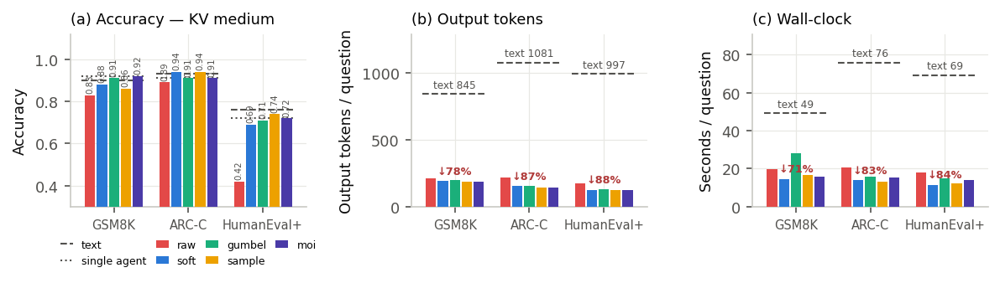
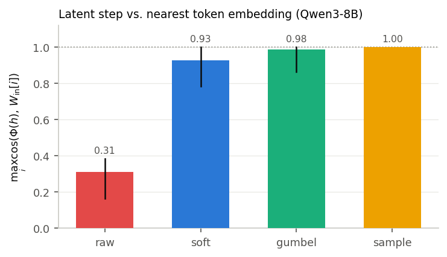

<a name="readme-top"></a>

<h1 align="center">QuantaLatent</h1>

<h3 align="center">
Which equation should build a latent thought?
</h3>

<p align="center">
A controlled comparison of five latent-step formulations for multi-agent collaboration
</p>

<p align="center">
    <a href="https://arxiv.org/abs/2511.20639"></a>
    <a href="https://arxiv.org/abs/2505.14827"></a>
    <a href="https://arxiv.org/abs/2508.03440"></a>
    
    
    
</p>

---

<p align="center">
  
</p>

## 💡 Introduction

In latent multi-agent systems, agents stop writing text to each other and pass
**latent thoughts** instead. Every such system rests on one small equation: a
latent reasoning step produces a hidden state, and something has to turn that
hidden state back into an input the model can consume. LatentMAS solves this
with a ridge-regression map $W_a$ between the model's two embedding matrices —
introduced as an engineering fix, never compared against an alternative.

The single-model latent-reasoning literature has meanwhile produced several
other ways to build that input, all of which first turn the hidden state into a
distribution over the vocabulary and then mix token embeddings. **QuantaLatent
puts them in the same harness and asks which one you should actually use.**

Five formulations are compared, holding *everything* else fixed — agent
topology, prompts, backbone, and the exact questions:

| Formulation | Latent step | Convex family | Source |
|---|---|---|---|
| `raw` | $\rho \, hM/\lVert hM\rVert$ (ridge $W_a$) | ✗ | LatentMAS |
| `soft` | $w = p$ | ✓ | Soft Thinking |
| `gumbel` | $w = \mathrm{softmax}((\ell + g)/T)$ | ✓ | Stochastic Soft Thinking |
| `sample` | $w = e_y$ | ✓ | categorical sampling (discrete control) |
| `moi` | entropy-weighted posterior of $p$ and $e_y$ | ✓ | Mixture of Inputs |

The harness spans **three communication media** (`text`, `kv`, `kv_and_text`,
plus a single-agent reference) and **four tasks** — GSM8K, ARC-Challenge,
HumanEval+, and alpha-factor DSL generation, ordered by how exactly the output
symbols must be written. The headline benchmark comparison covers `text`, `kv`,
and the single-agent reference at 100 questions per cell; `kv_and_text` ran at
5 questions per cell as a transcript supplier only, and is excluded from every
table and test below. All runs are training-free on a
local **Qwen3-8B** with $m = 10$ latent steps and a fixed sequential chain —
four agents on the benchmark arm (planner → critic → refiner → judger), three
on the factor arm (proposal → innovate → construct), single-pass, no evolution
layer.

## 📊 Key results

**1 — The choice of equation is invisible on general reasoning and decisive on code.**
Accuracy on the KV medium, 100 paired questions per cell:

| Task | single | text | `raw` | `soft` | `gumbel` | `sample` | `moi` | Cochran $Q$ |
|---|---|---|---|---|---|---|---|---|
| GSM8K | 0.92 | 0.90 | 0.83 | 0.88 | 0.91 | 0.86 | **0.92** | $p = 0.116$ |
| ARC-C | 0.91 | 0.93 | 0.89 | **0.94** | 0.91 | **0.94** | 0.91 | $p = 0.152$ |
| HumanEval+ | 0.72 | 0.76 | **0.42** | 0.69 | 0.71 | **0.74** | 0.72 | $p < 0.0001$ |

Of 63 exact McNemar tests, **6 survive Holm correction — all on HumanEval+, all
involving `raw`**. No pair inside the convex family survives anywhere. The
contrast between the family mean and `raw` is $+0.062$ on GSM8K and $+0.035$ on
ARC-C (both CIs contain zero) but $+0.295$ on HumanEval+ (CI $[+0.205, +0.388]$).

**2 — Latent communication replicates the efficiency claim.**
Against the text medium: **75.0%–87.8% fewer output tokens** and
**1.8×–6.1× faster**, bracketing the 70.8%–83.7% reported by LatentMAS on
different hardware and a different implementation. Accuracy is comparable, not
better — the supported claim is *same accuracy, far lower cost*.

**3 — The mechanism is geometric, and it is visible.**

<p align="center">
  
</p>

Convex-family steps land essentially on real token embeddings
(cosine to the nearest embedding row: 0.93 / 0.98 / 1.00); `raw` lands at
**0.312**, resembling no token at all. On Qwen3-8B the two embedding matrices
are *not* tied, so the realignment matrix is far from identity
($\lVert M - I\rVert_F / \lVert I\rVert_F = 1.04$, mean $\cos(h, hM) = 0.0112$).
On a pure latent channel carrying function names, `raw` recalls **0.000** of the
payload while the convex family recalls 0.34–0.38 at $m=10$ and 0.72–0.87 at
$m=40$.

**4 — On symbolic output the gap becomes a wall.**
In the alpha-factor arm, `raw` produced unparsable output on **14 of 18 calls
(78%)**, versus 0%–40% for the convex family, and yielded 11 expressions (3
evaluable) against 22–33 (21–26 evaluable). Damage shows up as sub-word
corruption — `"f actor"`, `"abnormallylyhigh-volumeolumedays"` — harmless in a
one-number answer, fatal in an identifier.

> Full statistics, ablations, and threats to validity live in
> [`docs/HASIL_TAHAP0.md`](docs/HASIL_TAHAP0.md) and the thesis (Indonesian).

## 🗺️ Repository layout

```
backend/
  llm/        LLM engine: model, KV cache, latent_pass, the five formulations  ← AXIS A
  mas/        agents, KV operations, factor chain pipeline                     ← AXIS B
  bench/      LatentMAS replication arm (data · scoring · pipeline · run_bench · compare)
  factor/     alpha-factor arm (run_factor.py)
  dsl/        expression parser · AST · function library (71 functions)
  gate/       expression quality gate: regulator, arity, redundancy, complexity
  eval/       ic.py · backtest.py · stats.py · fidelity.py · channel_capacity.py
              compare_modes.py · realign_probe.py · b7_probe.py · rescore_all.py
  prompts/    factor.yaml (QuantaLatent) · bench.yaml (ported from LatentMAS)
  paths.py    canonical paths + sys.path bootstrap     qlog.py  logger (loguru)
configs/      matriks.yaml — the experiment cell list (single source of truth)
scripts/      gen_perintah.py (derive run commands) · jalankan_matriks.py (runner)
reference/    LatentMAS @9a9e4d3 · mixinputs @7aef34b (pinned, READ-ONLY)
docs/         experiment design, staged results, critical audit (Indonesian)
results/      tracked run artifacts — probe/ · bench/ · factor/ · pendukung/
assets/       README figures, regenerated by scripts/plot_readme_figures.py
```

`backend/` is the package root. Run anything with `PYTHONPATH=backend`, or call
a CLI script directly — each one bootstraps its own path via `paths.bootstrap()`.

## 🚀 Quick start

```bash
git clone https://github.com/pastastick/multi-agent-system.git
cd multi-agent-system
uv sync                      # torch 2.6.0+cu124 from the cu124 index
source .venv/bin/activate
```

Verify the install without a GPU:

```bash
PYTHONPATH=backend python -c "
import llm.client, mas.pipeline, bench.pipeline, gate, dsl.expr_parser, eval.ic
from eval.ic import Lab
print(Lab(mode='fast').ic('RANK(\$volume)'))   # <IC=-0.04493 t=-6.72 n=243 ...>
"
```

**Benchmark arm** — one process is one matrix cell:

```bash
PYTHONPATH=backend python backend/bench/run_bench.py \
    --task gsm8k --latent-mode gumbel --comm-mode kv \
    --limit 100 --sample-seed 0 --seed 0
```

`--task` ∈ `gsm8k` · `arc_challenge` · `humanevalplus`
`--latent-mode` ∈ `raw` · `soft` · `gumbel` · `sample` · `moi`
`--comm-mode` ∈ `kv` · `kv_and_text` · `text`; `--baseline` for a single agent

> `--sample-seed` **must** match across cells — that is what makes every method
> see the same questions and the paired tests valid. `bench/compare.py` verifies
> it by fingerprint and *drops* cells that disagree.

**Alpha-factor arm** — symbolic payload through the same channel:

```bash
PYTHONPATH=backend python backend/factor/run_factor.py \
    --comm-mode kv --latent-mode gumbel --latent-steps 10 \
    --seeds 0,1,2 --directions d0,d1 --tag kv_gumbel
```

**The whole matrix**, derived from config rather than typed by hand:

```bash
python scripts/gen_perintah.py --arm bench    # 36 cells
python scripts/gen_perintah.py --arm factor   # 11 cells
python scripts/jalankan_matriks.py --arm all --slots 2   # VRAM-gated queue runner
```

Hand-writing run commands is a mistake the generator prevents: `comm_mode=text`
has no latent step at all, so it must run **once per task**, not once per
formulation — otherwise one text cell is duplicated five times and miscounted
as five independent observations.

**Analysis** (CPU only, no GPU needed):

```bash
python backend/bench/compare.py --out results/bench/analisis.json  # McNemar + bootstrap CI
PYTHONPATH=backend python backend/eval/rescore_all.py              # rescore factor corpus
python backend/eval/compare_modes.py                               # latent channel capacity
python scripts/plot_readme_figures.py                              # regenerate README figures
```

Hardware used for the published numbers: a single A40 (46 GB). A benchmark cell
needs ~18 GB, a factor cell ~21 GB — so at most **two** cells run in parallel.

## 📁 Results

`results/` is tracked on purpose: every number in the thesis is traceable to a
file here.

| path | contents |
|---|---|
| `results/bench/` | per-question outcomes and summaries for all benchmark cells |
| `results/factor/` | generated DSL expressions, gate verdicts, IC/backtest scores |
| `results/probe/` | Stage-0 artifacts: realignment probe, latent geometry, channel capacity |
| `results/pendukung/` | aggregates: token usage, token corruption, gate effectiveness |

Regenerable or oversized artifacts (IC series, raw LLM snapshots, per-agent
traces) are excluded in `results/.gitignore`, which documents how to rebuild each.

## 🔍 Fidelity to the reference implementations

`reference/` pins the two papers' code at a fixed commit so that
"our implementation follows paper X" can be checked, not just asserted. It is
never imported at run time. Verified line by line on 2026-08-10:

- **`raw`** matches `reference/LatentMAS/models.py` **exactly** — Gram matrix,
  `1e-5` regularization, RHS, solve, `target_norm`, and the apply step.
- **`moi`** is **algebraically identical** to `reference/mixinputs` (shown by
  substitution from its two-step vLLM form). One deliberate divergence: the
  reference normalizes entropy over a top-20 logprob slice ($\log 20$, a vLLM
  API limitation) while this harness uses the full vocabulary ($\log V$) via
  direct logit access — closer to the paper's definition, but not a
  bit-identical replication of that code. Derivation in
  [`docs/HASIL_TAHAP0.md`](docs/HASIL_TAHAP0.md) §9.2.

## 📚 Documentation

The operational and design documents are written in Indonesian, matching the
thesis they support.

| document | what it answers |
|---|---|
| [`docs/PANDUAN.md`](docs/PANDUAN.md) | setup on RunPod, environment, data, troubleshooting |
| [`docs/DESAIN_EKSPERIMEN.md`](docs/DESAIN_EKSPERIMEN.md) | what is measured and why — read this first |
| [`docs/HASIL_TAHAP0.md`](docs/HASIL_TAHAP0.md) | Stage-0 numbers, per-mode formulas, fidelity derivations |
| [`docs/HASIL_TAHAP4.md`](docs/HASIL_TAHAP4.md) | earlier staged results on the production path |
| [`docs/AUDIT_KRITIS.md`](docs/AUDIT_KRITIS.md) | critical audit of factor quality, reproducible on CPU |

## 📝 Citation

```bibtex
@thesis{yahya2026quantalatent,
  title  = {Evaluasi Komunikasi Laten pada Sistem Multi-Agen:
            Perbandingan Formulasi Representasi Laten terhadap
            Komunikasi Berbasis Teks},
  author = {Harun Yahya},
  school = {Universitas Gadjah Mada},
  type   = {Undergraduate thesis},
  year   = {2026},
  note   = {In progress}
}
```

## 🙏 Acknowledgements

This work builds directly on [LatentMAS](https://github.com/Gen-Verse/LatentMAS)
(Gen-Verse), [Mixture of Inputs](https://github.com/EvanZhuang/mixinputs), and
Stochastic Soft Thinking. The alpha-factor arm uses the QuantaAlpha task
formulation. Their code in `reference/` remains under its original Apache-2.0
licenses.

## ⚖️ License

MIT — see [LICENSE](LICENSE). Vendored code under `reference/` keeps its
upstream Apache-2.0 license.

<p align="right">(<a href="#readme-top">back to top</a>)</p>
